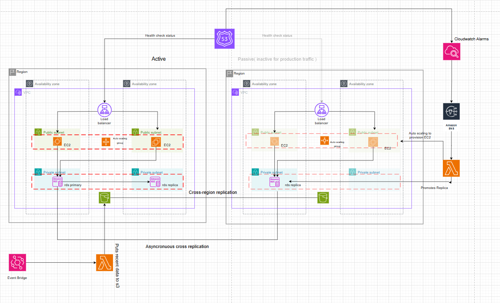

# **Disaster Recovery Infrastructure on AWS with Terraform**

This project automates the creation of a highly available application environment on AWS, complete with a primary operating region and a fully configured disaster recovery (DR) region. By leveraging Terraform, I've defined the infrastructure as code, ensuring consistency, repeatability, and efficient management. The DR region stands ready to take over in the event of a failure in the primary region, minimizing downtime and ensuring business continuity.

---

## **Project Goals and Implementation Highlights**

Our primary goal was to build a robust and automated disaster recovery solution for a web application. This involved several key steps and considerations, all implemented using Terraform:

- **Establishing Isolated Networks:** Virtual Private Clouds (VPCs) in both the primary and DR AWS regions, with public/private subnet segmentation.
- **Securing Application Access:** Security groups controlling inbound/outbound traffic to EC2, ALBs, and RDS.
- **Load Balancing for High Availability:** ALBs in each region to distribute traffic across EC2 instances.
- **Database Resilience:** Multi-AZ Amazon RDS in primary, and an RDS read replica in DR region.
- **Secure Credential Management:** Managed via AWS Secrets Manager in both regions.
- **Automated Certificate Management:** SSL/TLS via AWS Certificate Manager, validated through Route 53.
- **Dockerized Application Deployment:** Docker installed on EC2 via user data scripts, pulling application images securely.
- **Automated Failover Mechanism:** Lambda function triggered by Route 53 health checks to promote DR infrastructure.
- **DNS-Based Traffic Redirection:** Failover routing policies in Route 53 redirect traffic upon failure.
- **Auto Scaling in the DR Region:** ASG in DR region initially minimal, scales on failover.
- **Monitoring and Alerting:** CloudWatch monitoring and SNS alerts for failure detection and response.

---

## **Infrastructure Overview**



### **Primary Region**

- **VPC**: Public and private subnets.
- **EC2**: Dockerized application.
- **ALB**: Load balances traffic to EC2.
- **RDS**: Multi-AZ primary DB.
- **Route 53**: Failover DNS for PRIMARY.
- **Secrets Manager**: Stores DB credentials.
- **ACM**: SSL/TLS certificate.
- **S3**: Backups storage.
- **Lambda (Backup)**: Periodic RDS backups.

### **Disaster Recovery Region**

- **VPC & Subnets**: Mirrored setup.
- **RDS Replica**: Syncs from primary.
- **EC2 + ASG**: Auto-scaled on failover.
- **ALB**: Fronts DR EC2.
- **Lambda (Failover)**: DR promotion logic.
- **Route 53**: Failover DNS for SECONDARY.
- **ACM (DR)**: DR region certificate.
- **Secrets Manager (DR)**: DR DB credentials.

---

---

## **Setup & Configuration**

### **Requirements**

- Terraform
- AWS CLI configured
- AWS IAM permissions (VPC, EC2, RDS, ALB, Secrets Manager, etc.)
- A registered domain (for ACM DNS validation)

### **Terraform Backend Setup**

```hcl
terraform {
  backend "s3" {
    bucket       = "your-terraform-state-bucket"
    key          = "terraform.tfstate"
    region       = "us-east-1"
    encrypt      = true
    use_lockfile = true
  }
}
```

### **Deployment Instructions**

1. **Initialize Terraform:**

   ```bash
   terraform init
   ```

2. **Plan the Infrastructure:**

   ```bash
   terraform plan -out=tfplan
   ```

3. **Apply the Plan:**

   ```bash
   terraform apply tfplan
   ```

4. **Accessing the Application:**

   - Visit the Route 53-managed `PRIMARY` domain.
   - If the primary region fails, Route 53 will redirect traffic to the DR ALB and the Lambda function will promote the DR environment.

---

## **Failover Process**

1. Route 53 detects failure via health checks.
2. DNS traffic is redirected to DR ALB.
3. Cloudwatch alarms and SNS triggers Lambda which:
   - Promotes RDS replica to primary.
   - Updates Secrets Manager.
   - Scales up EC2 in DR via ASG.

---

## **Key Terraform Configurations**

### `primary/main.tf` Highlights

- **`vpc_primary`**: Creates VPC and subnets.
- **`security_group_primary`**: Security group setup.
- **`rds_primary`**: Multi-AZ primary RDS.
- **`acm_primary`**: ACM certificate with DNS validation.
- **`ec2_primary`**: EC2 with Docker, linked to Secrets Manager.
- **`alb_primary`**: ALB for traffic management.
- **`route53_primary`**: DNS with PRIMARY failover routing.
- **`secretsmanager_primary`**: DB credentials secret.
- **`s3_bucket_primary`**: S3 for backups.
- **`lambda_backup`**: Backup automation.
- **`monitoring_primary`**: Health checks and alerting.

### `dr/main.tf` Highlights

- **`vpc_dr`**: DR region VPC/subnets.
- **`security_group_dr`**: Security groups for DR.
- **`rds_dr`**: RDS read replica.
- **`alb_dr`**: DR ALB.
- **`acm_dr`**: ACM in DR region.
- **`launch_template_dr`**: EC2 launch setup.
- **`autoscaling_group_dr`**: ASG for failover scale-up.
- **`route53_dr`**: Failover DNS (SECONDARY).
- **`lambda_failover`**: DR promotion logic.
- **`secret_manager`**: DR DB secrets.

---

## **Scripts**

### `dr_user_data.sh`

- Installs Docker and AWS CLI.
- Pulls DB secrets from Secrets Manager.
- Runs app Docker container with credentials.

### `install_docker.sh`

- Installs Docker and Docker Compose.

### `lambda.zip`

- Lambda for:
  - RDS promotion
  - Secrets update
  - DR ASG scale-up

### `backup_lambda/backup_lambda.zip`

- Lambda for periodic RDS backups.

---

## **Monitoring and Alerts**

- CloudWatch monitors endpoints.
- SNS topics send alerts and trigger Lambda.
- Health checks tied to Route 53 DNS failover logic.

---

## **Cleanup**

To destroy all infrastructure:

```bash
terraform destroy
```

---

## **Contributions**

Contributions are welcome! Please open issues or pull requests to suggest improvements or report bugs.

---

```

```
